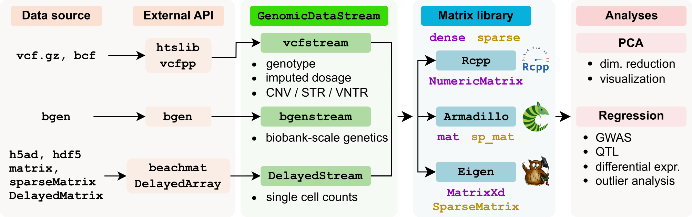

## GenomicDataStream 
### A scalable interface between data and analysis underneath R



<div align="justify"> 
Reading genomic data files (<a href="https://www.ebi.ac.uk/training/online/courses/human-genetic-variation-introduction/variant-identification-and-analysis/understanding-vcf-format/">VCF</a>,
<a href="https://samtools.github.io/bcftools/howtos/index.html">BCF</a>,
<a href="https://www.chg.ox.ac.uk/~gav/bgen_format/index.html">BGEN</a>,
<a href="https://anndata.readthedocs.io/en/latest/index.html">H5AD</a>,
<a href="https://bioconductor.org/packages/DelayedArray">DelayedArray</a>) into R/Rcpp in chunks for analysis with <nobr><a href="https://doi.org/10.21105/joss.00026">Armadillo</a></nobr> / <a href="eigen.tuxfamily.org">Eigen</a> / <a href="https://www.rcpp.org">Rcpp</a> libraries.  Mondern datasets are often too big to fit into memory, and many analyses <nobr>operate</nobr> a small chunk features at a time.  Yet in practice, many implementations require the whole dataset stored in memory.  Others pair an analysis with a specific data format (i.e. regresson analysis paired with genotype data from a VCF) in way that the two components can't be separated for use in other applications.


The `GenomicDataStream` C++ interface separates:
 
1. data source 
2. streaming chunks of features into a data matrix
3. downstream analysis  
</div> 

### See header-only C++ library [documentation](doxygen/html/index.html)
 

### Example code with C++17
```c++
#include <RcppArmadillo.h>
#include <GenomicDataStream.h>

// use namespace for GenomicDataStream
using namespace gds;

// parameters 
string file = "test.vcf.gz";
string field = "DS";    // read dosage field
string region = "";     // no region filter
string samples = "-";   // no samples filter
int chunkSize = 4;      // each chunk will read 4 variants

// initialize parameters
Param param(file, region, samples, chunkSize);
param.setField( field );

// Initialise GenomicDataStream to read 
// VCF/BCF and BGEN with same interface
unique_ptr<GenomicDataStream> gdsStream = createFileView( param );

// declare DataChunk storing an Armadillo matrix for each chunk
DataChunk<arma::mat> chunk;

// Store meta-data about each variant
VariantInfo *info;

// loop through chunks
while( gdsStream->getNextChunk( chunk ) ){

    // get data from chunk
    // chunk.getData();

    // get variant information
    info = chunk.getInfo<VariantInfo>();

    // Do analysis with variants in this chunk
}
```

## Supported formats
#### Genetic data 
| Format | Version | Support |
| -- | --- | --------- |
| BGEN | 1.1 | biallelic variants
|BGEN |1.2, 1.3| phased or unphased biallelic variants
|VCF / BCF | 4.x | biallelic variants with `GT/GP` fields, continuous dosage with `DS` field

#### Single cell data
Count matrices for single cell data are stored in the H5AD format.  This format, based on [HDF5](https://en.wikipedia.org/wiki/Hierarchical_Data_Format), can store millions of cells since it is designed for sparse counts (i.e. many entries are 0) and uses built-in compression.  H5AD enables file-backed random access for analyzing a subset of the data without reading the entire file in to memory.


## Dependencies

| Package | Ref | Role |
| - | --- | --------- |
[vcfppR](https://cran.r-project.org/package=vcfppR) | [Bioinformatics](https://doi.org/10.1093/bioinformatics/btae049)  | C++ API for htslib  |
[htslib](https://github.com/samtools/htslib) | [GigaScience](https://doi.org/10.1093/gigascience/giab007)  | C API for VCF/BCF files |
[beatchmat](https://bioconductor.org/packages/beachmat/) | [PLoS Comp Biol](https://doi.org/10.1371/journal.pcbi.1006135)  | C++ API for access data owned by R |
[DelayedArray](https://bioconductor.org/packages/DelayedArray/) | | R interface for handling on-disk data formats |
[Rcpp](https://cran.r-project.org/package=Rcpp)| [J Stat Software](https://doi.org/10.18637/jss.v040.i08) |  API for R/C++ integration
[RcppEigen](https://cran.r-project.org/package=RcppEigen) | [J Stat Software](https://doi.org/10.18637/jss.v052.i05) | API for Rcpp access to Eigen matrix library
[RcppArmadillo](https://cran.r-project.org/package=RcppArmadillo)| [J Stat Software](https://doi.org/10.18637/jss.v040.i08) | API for Rcpp access to Armadillo matrix library
[Eigen](https://eigen.tuxfamily.org) | |C++ library for linear algebra with advanced features
[Armadillo](https://arma.sourceforge.net) | [J Open Src Soft](https://doi.org/10.21105/joss.00026) | User-friendly C++ library for linear algebra


## Notes

`GenomicDataStream` provide flexability in terms of data input types and and matrix libraries.  This can useful in many cases, but the large number of dependencies can require installation of additional libraries and increase compile times.  Some of these dependencies can be avoided by removing support for some capabilities with compiler flags in `Makevars`:

 `-D DISABLE_DELAYED_STREAM`     
&nbsp;&nbsp;&nbsp;&nbsp;&nbsp;&nbsp;&nbsp;&nbsp;&nbsp;&nbsp;
Omit `DelayedStream` class, remove dependence on `Rcpp` and `beachmat`
 
 `-D DISABLE_EIGEN`   
&nbsp;&nbsp;&nbsp;&nbsp;&nbsp;&nbsp;&nbsp;&nbsp;&nbsp;&nbsp;
Omit support for Eigen matrix library, and remove dependence on `RcppEigen` and `Eigen`

 `-D DISABLE_RCPP`  
&nbsp;&nbsp;&nbsp;&nbsp;&nbsp;&nbsp;&nbsp;&nbsp;&nbsp;&nbsp; 
Omit support for `Rcpp` matrix library, and remove dependence on `Rcpp`

`GenomicDataStream` is written so that core functions are in C++17 with no dependence or R or Rcpp.  On top of that, there is a thin wrapper that uses Rcpp to interface between R and the lower-level library.


