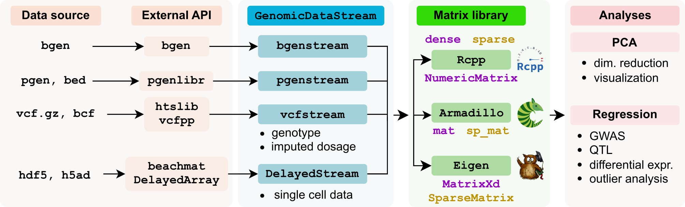

<br>

### A scalable interface between genomic data and analysis underneath R



<div align="justify"> 
Reading genomic data files (<a href="https://www.ebi.ac.uk/training/online/courses/human-genetic-variation-introduction/variant-identification-and-analysis/understanding-vcf-format/">VCF</a>,
<a href="https://samtools.github.io/bcftools/howtos/index.html">BCF</a>,
<a href="https://www.chg.ox.ac.uk/~gav/bgen_format/index.html">BGEN</a>,
<a href="https://www.cog-genomics.org/plink/2.0/input#pgen">PGEN</a>,
<a href="https://www.cog-genomics.org/plink/2.0/input#bed">BED</a>,
<a href="https://anndata.readthedocs.io/en/latest/index.html">H5AD</a>,
<a href="https://en.wikipedia.org/wiki/Hierarchical_Data_Format">HDF5</a>,
<a href="https://bioconductor.org/packages/DelayedArray">DelayedArray</a>) into R/Rcpp in chunks for analysis with <nobr><a href="https://doi.org/10.21105/joss.00026">Armadillo</a></nobr> / <a href="https://eigen.tuxfamily.org/index.php?title=Main_Page">Eigen</a> / <a href="https://www.rcpp.org">Rcpp</a> libraries.  Mondern datasets are often too big to fit into memory, and many analyses <nobr>operate</nobr> on a small chunk features at a time.  Yet in practice, many implementations require the whole dataset stored in memory.  Others pair an analysis with a specific data format in way that the two components can't be separated for use in other applications.  For example, regression analysis paired with genotype data from a VCF file.

The `GenomicDataStream` interface separates:
 
1. data source 
2. streaming chunks of features into a data matrix
3. downstream analysis 

`GenomicDataStream` provides interfaces at both the C++ and R levels.  The C++ interface prioritizes efficiency, while the R interface wraps the C++ backend for non-technical users.
</div> 

### See header-only C++ library [documentation](doxygen/html/index.html)
 

### Install
```r
# Install latest version of GenomicDataStream and dependencies
BiocManager::install("GabrielHoffman/GenomicDataStream")
```


### Supported formats

#### Genetic data 
| Format | Version | Support |
| -- | --- | --------- |
| BGEN | 1.1 | biallelic variants
| BGEN |1.2, 1.3| phased or unphased biallelic variants
| PGEN | plink2 | biallelic variants
| BED | plink1 | biallelic variants
| VCF / BCF | 4.x | biallelic variants with `GT/GP` fields, continuous dosage with `DS` field

#### Single cell data
<div align="justify"> 
Count matrices for single cell data are stored in the H5AD format.  This format, based on <a href="https://en.wikipedia.org/wiki/Hierarchical_Data_Format">HDF5</a>, can store millions of cells since it is designed for sparse counts (i.e. many entries are 0) and uses built-in compression.  H5AD enables file-backed random access for analyzing a subset of the data without reading the entire file in to memory.
</div> 


### Key Dependencies

| Package | Ref | Role |
| - | --- | --------- |
[vcfppR](https://cran.r-project.org/package=vcfppR) | [Bioinformatics](https://doi.org/10.1093/bioinformatics/btae049)  | C++ API for htslib  |
[htslib](https://github.com/samtools/htslib) | [GigaScience](https://doi.org/10.1093/gigascience/giab007)  | C API for VCF/BCF files |
[pgenlibr](https://cran.r-project.org/package=pgenlibr) | [GigaScience](https://doi.org/10.1186/s13742-015-0047-8)  | R/C++ API for plink files |
[beatchmat](https://bioconductor.org/packages/beachmat/) | [PLoS Comp Biol](https://doi.org/10.1371/journal.pcbi.1006135)  | C++ API for access data owned by R |
[DelayedArray](https://bioconductor.org/packages/DelayedArray/) | | R interface for handling on-disk data formats |
[Rcpp](https://cran.r-project.org/package=Rcpp)| [J Stat Software](https://doi.org/10.18637/jss.v040.i08) |  API for R/C++ integration
[RcppEigen](https://cran.r-project.org/package=RcppEigen) | [J Stat Software](https://doi.org/10.18637/jss.v052.i05) | API for Rcpp access to Eigen matrix library
[RcppArmadillo](https://cran.r-project.org/package=RcppArmadillo)| [J Stat Software](https://doi.org/10.18637/jss.v040.i08) | API for Rcpp access to Armadillo matrix library
[Eigen](https://eigen.tuxfamily.org/index.php?title=Main_Page) | |C++ library for linear algebra with advanced features
[Armadillo](https://arma.sourceforge.net) | [J Open Src Soft](https://doi.org/10.21105/joss.00026) | User-friendly C++ library for linear algebra
[RcppParallel](https://rcppcore.github.io/RcppParallel/) | | oneAPI [Threading Building Blocks](https://uxlfoundation.github.io/oneTBB/) for parallel analysis


