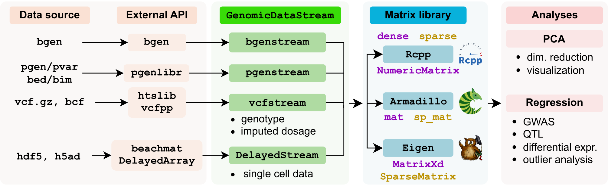

# GenomicDataStream 
### A scalable interface between data and analysis

 Read genomic data files ([VCF](https://www.ebi.ac.uk/training/online/courses/human-genetic-variation-introduction/variant-identification-and-analysis/understanding-vcf-format/), [BCF](https://samtools.github.io/bcftools/howtos/index.html), [BGEN](https://www.chg.ox.ac.uk/~gav/bgen_format/index.html), [H5AD](https://anndata.readthedocs.io/en/latest/index.html), [DelayedArray](https://bioconductor.org/packages/DelayedArray) into R/Rcpp in chunks for analysis with [Armadillo](https://doi.org/10.21105/joss.00026)/[Eigen](eigen.tuxfamily.org)/[Rcpp](https://www.rcpp.org) libraries.  Mondern datasets are often too big to fit into memory, and many analyses operate a small chunk features at a time.  Yet in practice, many implementations require the whole dataset stored in memory.  Others pair an analysis with a specific data format (i.e. regresson analysis paired genotype data from a VCF) in way that the two components can't be separated for use in other applications. 
 
 The `GenomicDataStream` C++ inferface separates 1) data source, 2) streaming chunks of features into a data matrix, and 3) downstream analysis.  
 
 
Header-only C++ library

#### 1) Input:
  
 - VCF/BCF via `vcfstream`
 - BGEN via `bgenstream`
 - H5AD via `DelayedArray` to `DelayedStream`
  
#### 2) Data matrix:
 
 - `Rcpp::NumericMatix`
 - `arma::mat`
 - `Eigen::Map<Eigen::MatrixXd>`
 
#### 3) Analyses
 - Regression
 - PCA

 
 

## Dependencies

| Package  | Code | Ref | Role |
| -------- | ------- | -------------- | ------- |
| vcfppR  | [CRAN](https://cran.r-project.org/package=vcfppR) | [Bioinformatics](https://doi.org/10.1093/bioinformatics/btae049)  | C++ API for htslib  |
| htslib  | [GitHub](https://github.com/samtools/htslib) | [GigaScience](https://doi.org/10.1093/gigascience/giab007)  | C API for VCF/BCF files |
| beatchmat  | [BioC](https://bioconductor.org/packages/beachmat/) | [PLoS Comp Biol](https://doi.org/10.1371/journal.pcbi.1006135)  | C++ API for access data owned by R |
|Rcpp| [CRAN](https://cran.r-project.org/package=Rcpp)| [J Stat Software](https://doi.org/10.18637/jss.v040.i08) |  API for R/C++ integration
|RcppEigen|[CRAN](https://cran.r-project.org/package=RcppEigen) | [J Stat Software](https://doi.org/10.18637/jss.v052.i05) | API for Rcpp access to Eigen matrix library
|RcppArmadillo|[CRAN](https://cran.r-project.org/package=RcppArmadillo)| [J Stat Software](https://doi.org/10.18637/jss.v040.i08) | API for Rcpp access to Armadillo matrix library
|Eigen|[eigen](eigen.tuxfamily.org) | |C++ library for linear algebra with advanced features
|Armadillo| [arma](https://arma.sourceforge.net) | [J Open Src Soft](https://doi.org/10.21105/joss.00026) | User-friendly C++ library for linear algebra

	
	
